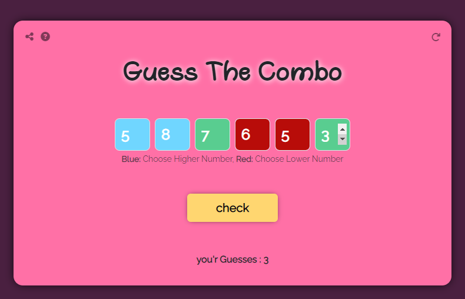
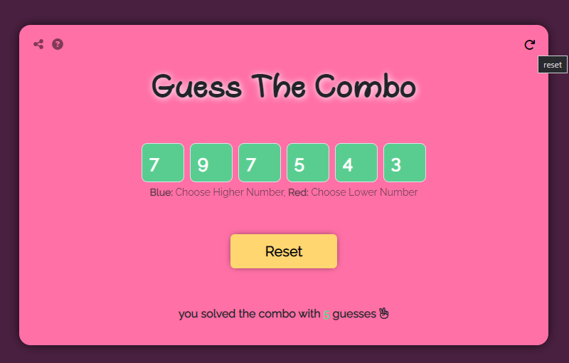

# GuessTheCombo-game
GuessTheCombo-game is a JavaScript game where players attempt to guess a secret combination of numbers. This project aims to provide an entertaining and challenging gaming experience. The game is built using ‍‍`Bootstrap`, a popular front-end framework, to enhance the user interface and provide a responsive design.

## How the Game Works
The game follows a simple set of rules:

1. At the start of each round, a secret combination of numbers is generated by the computer. The combination consists of a sequence of digits, for example, "1234".

2. The player's objective is to guess the secret combination within a limited number of attempts. The default number of attempts is set to 10, but this can be adjusted as per your preference.

3. For each attempt, the player enters a combination of numbers. The game will provide feedback based on the correctness of the guess.

4. When the player guesses the number correctly, the guessed number is highlighted with a green background to indicate a correct guess.

    1. If the guess is lower than the hidden number, the guessed number is highlighted with a blue background.
     2. This indicates that the player should choose a higher number in their next guess.
    3. Conversely, if the guess is higher than the hidden number, the guessed number is highlighted with a red background. This indicates that the player should choose a smaller number in their next guess.

These visual cues help the player in narrowing down their guesses to eventually determine the correct hidden number.

## Running the Game
To run the GuessTheCombo-game locally, follow these steps:

1. Ensure you have a compatible web browser installed on your system.

2. Clone the repository using the following command:

`git clone https://github.com/sadeq-yaqobi/GuessTheCombo-game.git`

3. Navigate to the project directory:

`cd GuessTheCombo-game`

4. Open the `index.html` file in your web browser.

5. The game interface will be displayed, allowing you to start playing.

## Code Explanation
The JavaScript code of this game is structured into several files located in the repository. Here is a brief overview of the key files and their functionalities:

- **`index.html`**: This file contains the HTML structure of the game interface, including the input fields, buttons, and display elements.

- **`style.css`**: The CSS file defines the styles and layout for the game interface, enhancing the visual appeal.

- **`script.js`**: The main JavaScript file that handles the game logic. It includes the following functions:

    1. **`generateSecretCombination()`**: Generates a random secret combination of numbers.

    2. **`checkGuess()`**: Compares the player's guess with the secret combination and provides feedback in terms of bulls and cows.

    3. **`updateGameStatus()`**: Updates the game status, including the number of attempts remaining and the feedback for the current guess.

    4. **`resetGame()`**: Resets the game to its initial state.

    5. **`handleGuessSubmission()`** : Handles the event when the player submits a guess.

Feel free to explore the code further for a detailed understanding of the game mechanics.

## Contributing
Contributions to GuessTheCombo-game are welcome! If you have any ideas for improvements or new features, please feel free to submit a pull request.

## License

GuessTheCombo-game is open-source and licensed under the [MIT License](https://opensource.org/licenses/MIT). You are free to use, modify, and distribute the code in accordance with the terms of this license.

